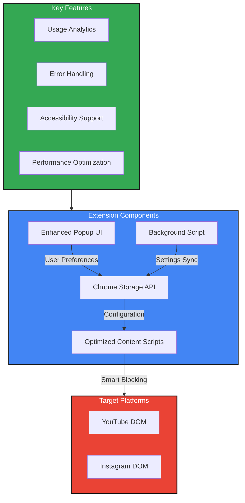

# Shorts & Reels Blocker: Digital Wellbeing Extension


## 🎯 Mission

**Combat short-form content addiction and reclaim your digital wellbeing.** This Chrome extension blocks YouTube Shorts and Instagram Reels, helping you maintain focus, improve productivity, and develop healthier online habits.

## 🚀 Quick Start

[](https://chromewebstore.google.com/detail/shorts-reels-blocker/hddclpebfglijbmapdjminkkcafchkmb)

1. **Install**: Click "Add to Chrome" above
2. **Configure**: Click the extension icon and toggle your preferences
3. **Enjoy**: Browse YouTube and Instagram distraction-free!

## ✨ Features

### 🛡️ Content Blocking

- **YouTube Shorts**: Blocks shorts from homepage, search results, and recommendations
- **Instagram Reels**: Hides reels from feed, explore page, and stories
- **Smart Detection**: Automatically adapts to platform changes
- **Performance Optimized**: Minimal impact on page loading speed

### 🎛️ User Control

- **Individual Toggle**: Enable/disable blocking for each platform
- **Real-time Updates**: Changes apply immediately without page refresh
- **Persistent Settings**: Your preferences are saved across sessions
- **Accessibility**: Full keyboard navigation and screen reader support

### 📊 Analytics & Insights

- **Blocking Statistics**: Track how many elements are blocked
- **Time Saved**: Estimate time saved from avoiding short-form content
- **Usage Analytics**: Optional local analytics for personal insights

### 🔒 Privacy & Security

- **Zero Data Collection**: No personal information gathered
- **Local Storage**: All data stays on your device
- **No Tracking**: No external analytics or tracking scripts
- **Open Source**: Transparent code for community review

## 🏗️ Technical Architecture



## 📸 Screenshots

### Enhanced Popup Interface


### YouTube with Shorts Blocked


## 🛠️ Installation

### Chrome Web Store (Recommended)

1. Visit the [Chrome Web Store](https://chromewebstore.google.com/detail/shorts-reels-blocker/hddclpebfglijbmapdjminkkcafchkmb)
2. Click "Add to Chrome"
3. Confirm installation when prompted

### Manual Installation (Developer)

1. Clone this repository:
   ```bash
   git clone https://github.com/Vignesh-kumar-D/shorts_reel_blocker.git
   cd shorts-reels-blocker
   ```
2. Open Chrome and navigate to `chrome://extensions/`
3. Enable "Developer mode" (top right toggle)
4. Click "Load unpacked" and select the extension directory

## ⚙️ Configuration

### Basic Setup

1. Click the extension icon in your Chrome toolbar
2. Toggle "Block YouTube Shorts" and/or "Block Instagram Reels"
3. Settings are automatically saved and applied

### Advanced Options

- **Statistics**: View blocking statistics in the popup
- **Privacy Policy**: Access via footer link in popup
- **Feedback**: Report issues or suggest features

## 🔧 Troubleshooting

### Common Issues

**Extension not working on YouTube/Instagram?**

- Ensure the extension is enabled in `chrome://extensions/`
- Try refreshing the page after enabling/disabling
- Check if the site has updated its DOM structure

**Settings not saving?**

- Clear browser cache and cookies
- Disable and re-enable the extension
- Check Chrome storage permissions

**Performance issues?**

- The extension is optimized for minimal impact
- If experiencing slowdowns, try disabling one platform at a time

### Getting Help

- **GitHub Issues**: [Report bugs here](https://github.com/Vignesh-kumar-D/shorts_reel_blocker/issues)
- **Email Support**: support@shortsreelsblocker.com
- **Documentation**: Check this README for detailed information

## 🧪 Development

### Prerequisites

- Chrome browser (version 88+)
- Basic knowledge of JavaScript and Chrome Extensions
- Git for version control

### Setup Development Environment

1. Clone the repository
2. Install dependencies (if any)
3. Load as unpacked extension in Chrome
4. Make changes and test locally

### Project Structure

```
shorts-reels-blocker/
├── manifest.json          # Extension configuration
├── popup.html            # Main popup interface
├── popup.js              # Popup functionality
├── youtube_blocker.js    # YouTube content blocking
├── instagram_blocker.js  # Instagram content blocking
├── styles.css            # UI styling
├── privacy-policy.html   # Privacy policy page
├── README.md             # This file
└── icons/                # Extension icons
```

### Building for Production

1. Update version in `manifest.json`
2. Test thoroughly on both platforms
3. Create ZIP file for Chrome Web Store submission
4. Update store listing with new features

## 🤝 Contributing

We welcome contributions! Here's how you can help:

### Ways to Contribute

- 🐛 **Report Bugs**: Use GitHub Issues
- 💡 **Suggest Features**: Open feature requests
- 🔧 **Code Contributions**: Submit pull requests
- 📝 **Documentation**: Improve README or add guides
- 🌟 **Star the Repo**: Show your support

### Development Guidelines

- Follow existing code style and patterns
- Add tests for new features
- Update documentation for changes
- Ensure accessibility compliance
- Test on both platforms before submitting

### Code of Conduct

- Be respectful and inclusive
- Focus on constructive feedback
- Help maintain a positive community

## 📊 Analytics & Privacy

### What We Track (Locally)

- Extension usage patterns
- Error logs for debugging
- Performance metrics
- User preferences

### What We Don't Track

- Personal information
- Browsing history
- Content you view
- Any data outside the extension

### Data Storage

- All data stored locally using Chrome Storage API
- No external servers or third-party services
- Data deleted when extension is uninstalled

## 🔮 Roadmap

### Planned Features

- [ ] TikTok blocking support
- [ ] Custom blocking rules
- [ ] Time-based blocking schedules
- [ ] Detailed usage analytics
- [ ] Mobile browser support
- [ ] Firefox extension version

### Recent Updates

- ✅ Performance optimizations
- ✅ Enhanced UI/UX
- ✅ Better error handling
- ✅ Accessibility improvements
- ✅ Privacy policy compliance

## 📄 License

This project is licensed under the MIT License - see the [LICENSE](LICENSE) file for details.

## 🙏 Acknowledgments

- Chrome Extensions team for the excellent documentation
- Open source community for inspiration and tools
- Users who provide feedback and suggestions
- Contributors who help improve the extension

## 📞 Contact

- **Email**: dvigneshkumar3@gmail.com
- **GitHub**: [https://github.com/Vignesh-kumar-D/shorts_reel_blocker(https://github.com/Vignesh-kumar-D/shorts_reel_blocker)
- **Chrome Web Store**: [Rate & Review](https://chromewebstore.google.com/detail/shorts-reels-blocker/hddclpebfglijbmapdjminkkcafchkmb)

---

**Made with ❤️ for better digital wellbeing**

_Help others break free from short-form content addiction by sharing this extension!_
