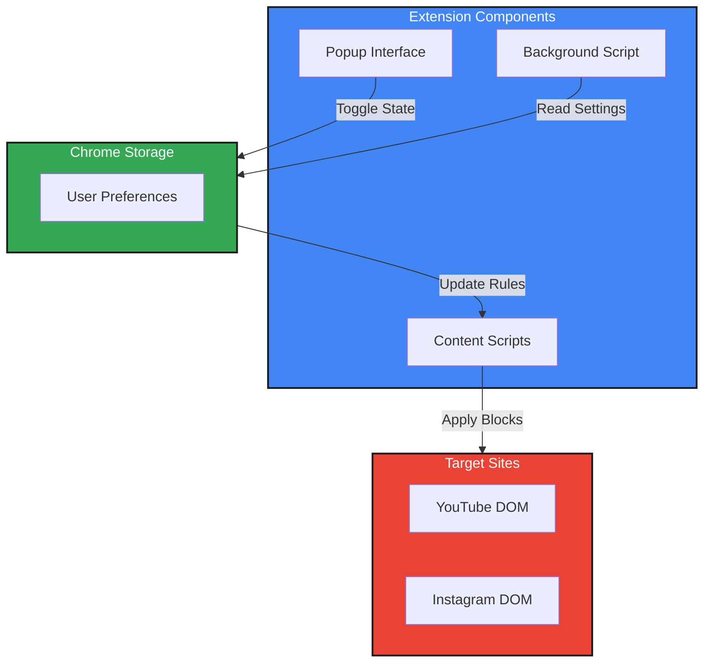

# Shorts & Reels Blocker: Fight Content Addiction

## 🧠 Purpose
A Chrome extension designed to combat short-form content addiction by blocking YouTube Shorts and Instagram Reels. Take back control of your attention span and enjoy these platforms' valuable content without falling into the endless scroll of short-form videos.

## 🔗 Installation

1. Visit the [Chrome Web Store](https://chromewebstore.google.com/detail/shorts-reels-blocker/hddclpebfglijbmapdjminkkcafchkmb)
2. Click "Add to Chrome"
3. Enjoy a distraction-free browsing experience!

## 🎯 Features
- blocks YouTube Shorts section from homepage
- Removes Shorts from YouTube search results
- Blocks Instagram Reels tab and feed
- Gives option to unblock if required and block again
- Lightweight and performance-optimized
- Simple toggle controls
- Zero data collection
- Works offline

## 🏗️ Architecture

## 💡 Why This Matters

### The Problem
- Short-form content is designed to be addictive
- Decreases attention span
- Reduces productivity
- Creates mindless scrolling habits

### The Solution
- Maintain access to valuable platform content
- Remove addictive short-form elements
- Improve focus and attention span
- Better time management

## 🛠️ Technical Implementation
- Vanilla JavaScript for performance
- Chrome Extension Manifest V3
- DOM manipulation for content blocking
- Chrome Storage API for preferences
- Event listeners for real-time updates

## 📸 Screenshots
[Placeholder: Add screenshots showing before/after states of YouTube and Instagram]

## ⚙️ Local Development

### Prerequisites
- Chrome browser
- Basic understanding of Chrome Extension development

### Setup
1. Clone the repository
2. Open Chrome and navigate to `chrome://extensions/`
3. Enable "Developer mode"
4. Click "Load unpacked" and select the extension directory

## 🤝 Contributing
Contributions are welcome! Feel free to:
- Report bugs
- Suggest features
- Submit pull requests

## 📝 Privacy Policy
- No user data collection
- No external server communication
- All preferences stored locally

## 🌟 Future Enhancements
- Custom blocking rules
- Time-based blocking
- Usage statistics (optional)
- Support for additional platforms

## 📜 License
[MIT](LICENSE)
